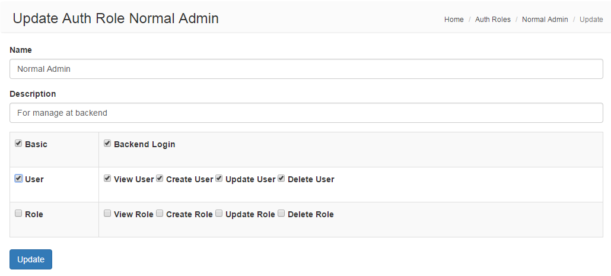

Yii2 Auth
=========
Yii2 Auth could manage operations in category, you could integrate it to [Yii2 Adminlte](https://github.com/funson86/yii2-adminlte)

Installation
------------

The preferred way to install this extension is through [composer](http://getcomposer.org/download/).

Either run

```
php composer.phar require funson86/yii2-auth "dev-master"
```

or add

```
"funson86/yii2-auth": "*"
```

to the require section of your `composer.json` file.


Usage
-----

Once the extension is installed, simply use it in your code by  :

### Migration

Migration run

```php
yii migrate --migrationPath=@funson86/auth/migrations
```

Or insert to table `setting` manually.
```php
CREATE TABLE `auth_operation` (
  `id` int(11) NOT NULL AUTO_INCREMENT,
  `parent_id` int(11) NOT NULL DEFAULT 0,
  `name` varchar(32) NOT NULL,
  PRIMARY KEY (`id`),
  KEY `parent_id` (`parent_id`)
) ENGINE=InnoDB AUTO_INCREMENT=100000 DEFAULT CHARSET=utf8 ROW_FORMAT=COMPACT COMMENT='Auth Operation';

CREATE TABLE `auth_role` (
  `id` int(11) NOT NULL AUTO_INCREMENT,
  `name` varchar(64) NOT NULL,
  `description` varchar(255) DEFAULT NULL,
  `operation_list` text,
  PRIMARY KEY (`id`)
) ENGINE=InnoDB AUTO_INCREMENT=21 DEFAULT CHARSET=utf8 ROW_FORMAT=COMPACT COMMENT='Auth Role';

INSERT INTO `auth_role` VALUES ('1', 'Super Admin', '', 'all');
INSERT INTO `auth_role` VALUES ('3', 'Normal Admin', '', 'backendLogin;viewUser;viewRole');

INSERT INTO `auth_operation` VALUES ('111', '0', 'basic');
INSERT INTO `auth_operation` VALUES ('113', '0', 'user');
INSERT INTO `auth_operation` VALUES ('114', '0', 'role');
INSERT INTO `auth_operation` VALUES ('11101', '111', 'backendLogin');
INSERT INTO `auth_operation` VALUES ('11302', '113', 'viewUser');
INSERT INTO `auth_operation` VALUES ('11303', '113', 'createUser');
INSERT INTO `auth_operation` VALUES ('11304', '113', 'updateUser');
INSERT INTO `auth_operation` VALUES ('11305', '113', 'deleteUser');
INSERT INTO `auth_operation` VALUES ('11402', '114', 'viewRole');
INSERT INTO `auth_operation` VALUES ('11403', '114', 'createRole');
INSERT INTO `auth_operation` VALUES ('11404', '114', 'updateRole');
INSERT INTO `auth_operation` VALUES ('11405', '114', 'deleteRole');

ALTER TABLE `user` ADD COLUMN `auth_role` int(11) AFTER `status`;
UPDATE `user` set `auth_role`=3;
UPDATE `user` set `auth_role`=1 where `username` = 'admin';
```

### Config /common/config/main.php to check authority
After add the following code, the code
*if(!Yii::$app->user->can('createRole')) throw new ForbiddenHttpException(Yii::t('app', 'No Auth'));*
in each action of controller could check whether current user have the authority to run this action or not.
```php
    'components' => [
        'user' => [
            'class' => 'funson86\auth\User',
            'enableAutoLogin' => true,
        ],
    ],
```

### CRUD Auth Role with operation at backend
Config backend modules in backend/config/main.php to manage settings

```php
    'modules' => [
        'auth' => [
            'class' => 'funson86\auth\Module',
        ],
    ],
```
Access backend url: http://you-domain/backend/web/auth

### Add Your Auth Operation
You could add your new operation based on business by migration or insert to table `auth_operation` manually.
```php
INSERT INTO `auth_operation` VALUES ('115', '0', 'Service');
INSERT INTO `auth_operation` VALUES ('11501', '115', 'viewService');
```

### Use Your Operation Check
Once you add new operation in `auth_operation`, add
`if (!Yii::$app->user->can('viewService')) throw new ForbiddenHttpException(Yii::t('app', 'No Auth'))`
at the beginning of action of controller like the following:
```php
class ServiceController extends Controller
{
    public function actionView($id)
    {
        if (!Yii::$app->user->can('viewService')) throw new ForbiddenHttpException(Yii::t('app', 'No Auth'));
        // you business code
    }
}
```

### Translation
If no translation, it will show you 'viewService' at the backend management. You could add the translation
in backend/messages/en/auth.php or backend/messages/zh-CN/auth.php. Like the following:
```php
return [
    'viewService' => 'View Service',
];
```

Preview
-------

